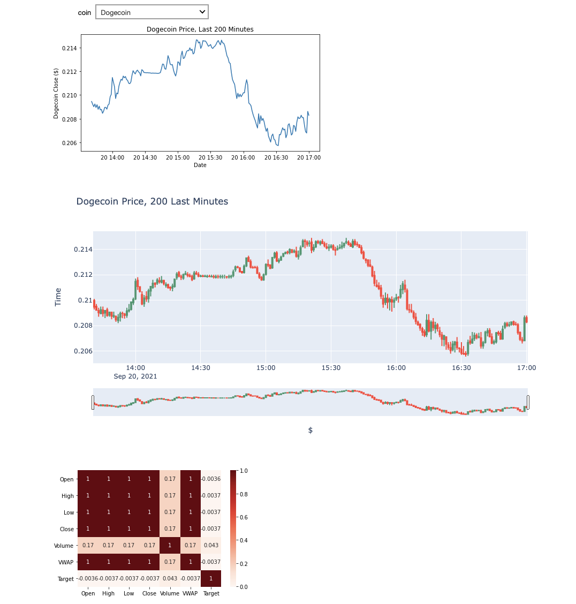
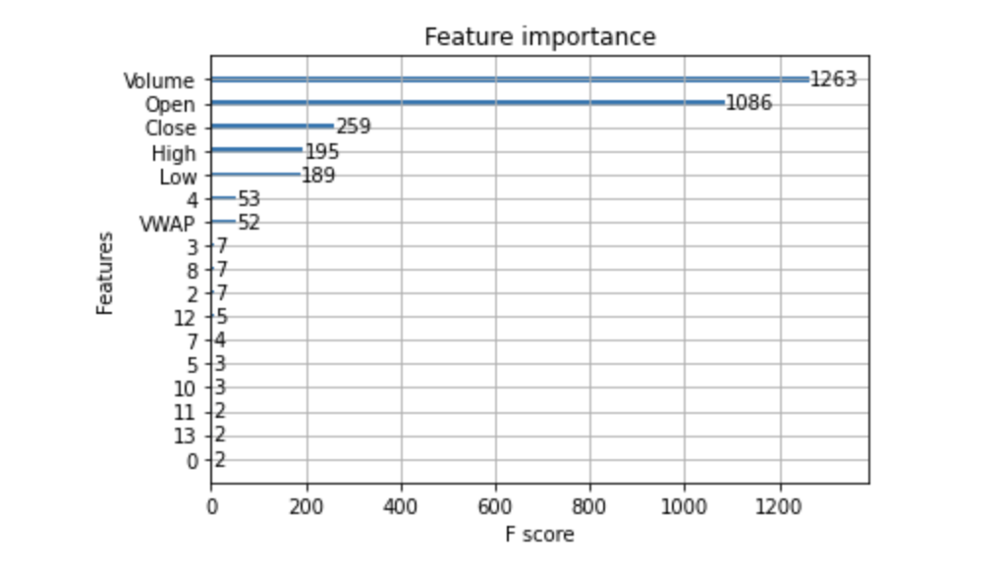

# Kaggle-Crypto-Competition
<strong>G-Research Crypto Forecasting:</strong> [Link](https://www.kaggle.com/c/g-research-crypto-forecasting/overview)

### Python Libraries
XGBoost, Sci-Kit Learn, Matplotlib, ipywidgets

### Summary
Forecasting short-term returns in 14 popular cryptocurrencies. The model is trained on 7 parameters: Asset_ID, Open, High, Low, Close, Volume, and VWAP. The target variable is derived from log returns over 15 minutes. The ultimate goal is to effective predict the alpha of an asset. However, there are several challenges including but not limited to overfitting and time complexity.

### Visualizations
In the "Notebook/Visualization.ipynb" file, viewers can select a coin then view the price candlesticks and a correlation heatmap.
 

### Model
I utilized XGBoost due to its improved processing speed over a Random Forest Regressor. I tuned the algorithm on a subset of the training set for hyperparameters learning_rate, max_depth, min_child_weight, colsample_bytree, and reg_lambda. The most significant variables appeared to be Volume, Open, Close, High, and Low. However, what was surprising was that Asset_ID 4, or Dogecoin, showcased significant predictive power when compared to other coins.
 
 
Most significant variables:
 

### Reflection
I was definitely taken away by both the complexity of maximizing accuracy and the size of the dataset. I fully understand the importance of Kaggle competitions as it tackles some of the most challenging real-world problems in the machine learning space. In the future, I would create a model that trains k different models for each asset type. In addition, I believe I need to utilize AWS Sagemaker to improve the runtime during model development.
